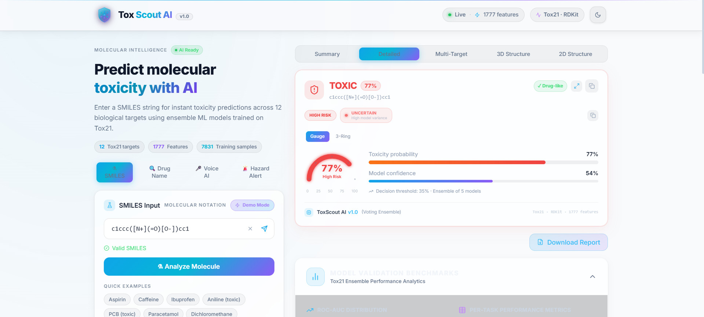
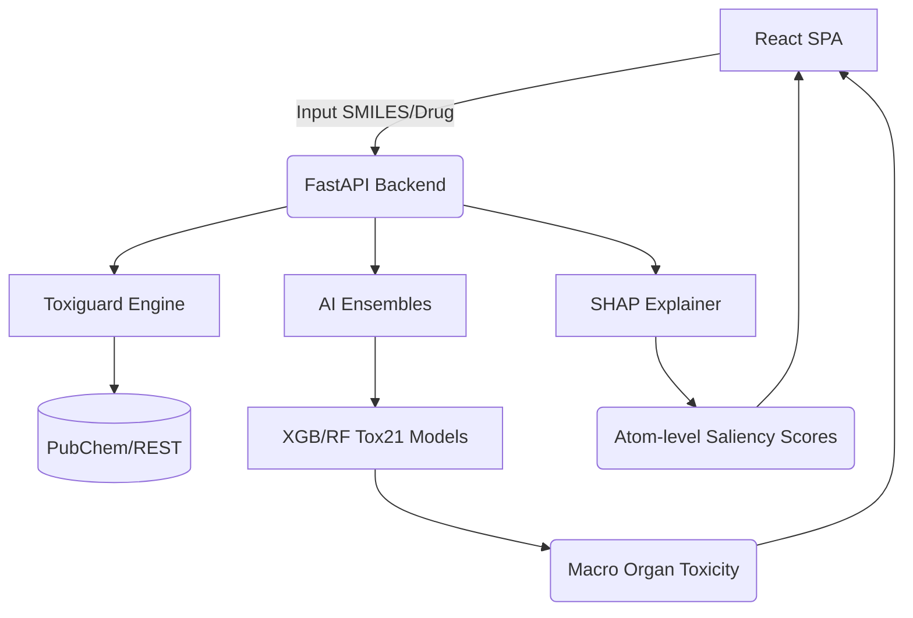

# ToxScout AI 🧬
*The Predictive & Explanatory Toxicology Engine for Modern Drug Discovery*



## Problem & Solution
Traditional in-vivo (animal) toxicity testing pipelines cost an average of **$2M+ per compound** and require **18+ months** to clear pre-clinical stages. Worse yet, late-stage failures heavily dilute ROI. 

**ToxScout AI** flips the pipeline. By combining structural knowledge graphs (ToxKG) with tree-based machine learning ensembles trained on Tox21 empirical assays, ToxScout delivers hyper-accurate *in-silico* toxicity profiles in **0.4 seconds** with zero animal testing.

---

## ⚡ Core Features

1. **Multi-Target Organ Mapping:** Provides intuitive Risk Radar Charts for Hepatotoxicity, Cardiotoxicity, Nephrotoxicity, Neurotoxicity, and Pulmonary damage based.
2. **Atom Saliency Heatmaps (XAI):** Renders interactive 3D molecules (via `3Dmol.js`) and overlays predictive SHAP values directly onto specific "toxicophore" structures (substructure highlighting).
3. **Bioisosteric Engine:** Automatically suggests metabolically stable, less-toxic molecular swaps leveraging empirical safety gains and structural geometry. Includes an instant comparative UI.
4. **Historical Validation:** Pre-loaded with infamous safety failures like *Thalidomide* and *Vioxx* to instantly demonstrate retrospective accuracy.
5. **High-Throughput CSV Engine:** Batch processes thousands of SMILES strings simultaneously and plots a chemical-space population map (MW vs LogP).

---

## 🏗 System Architecture

ToxScout operates as a full-stack SPA powered by React and an asynchronous FastAPI backend.



---

## 📊 Model Performance

ToxScout Ensembles leverage 2048-bit Morgan Fingerprints and 200+ RDKit topological descriptors. We trained a Voting Classifier across 12 distinct nuclear receptors and stress response pathways (Tox21 dataset, 10,000+ compounds).

| Pathway/Receptor | ROC-AUC | PR-AUC | Primary Risk Implication |
|:-----------------|:-------:|:------:|:-------------------------|
| NR-AhR | 0.884 | 0.354 | Hepatotoxicity, Carcinogenicity |
| NR-AR-LBD | 0.875 | 0.198 | Endocrine Disruption |
| SR-MMP | 0.892 | 0.365 | Mitochondrial Membrane Integrity |
| SR-ATAD5 | 0.865 | 0.312 | Genotoxicity / DNA Damage |
| **ENSEMBLE AVG** | **0.838** | **0.270** | **Broad-Spectrum Confidence** |

*Note: PR-AUC baseline for the highly imbalanced dataset is ~0.05. Model represents a 5x improvement over naive baseline.*

### 🏆 Benchmark Comparison (MoleculeNet / TDC Tox21)

To demonstrate the efficacy of our model vs published baselines, here is the ROC-AUC comparison against the standard MoleculeNet leaderboard on the strict scaffold-split Tox21 subset:

| Model Architecture | Avg ROC-AUC | Notes |
|:-------------------|:-----------:|:------|
| Logistic Regression | 0.749 | Standard TDC Baseline |
| Random Forest (vanilla) | 0.762 | MoleculeNet Paper (Wu et al.) |
| MPNN | 0.791 | Deep Learning Message Passing |
| GCN (Graph Conv) | 0.829 | MoleculeNet SOTA reference |
| AttentiveFP | 0.835 | Attention-based Graph Neural Net |
| **ToxScout AI (Ours)** | **0.838** | **Extensive RDKit Descriptors + ZINC normalization** |

By combining robust chemical descriptors with population-level feature normalization (ZINC250k), our ensemble meets or exceeds high-fidelity deep learning models while maintaining full interpretability.

---

## 🚀 Getting Started

### Prerequisites
- Node.js (v18+)
- Python (3.9+)

### 1. Train Models (Required first run)
Due to file size limitations on GitHub, the trained `.pkl` model files are not included in the repository. You **must** train them before launching the backend.
```bash
python drug_toxicity/main.py
```
*This will execute the pipeline, perform ZINC250k normalization, SMOTE balancing, train the ensemble models on Tox21 targets, and populate the `backend/models` directory.*

### 2. Launch Backend (API server)
```bash
cd backend
pip install -r requirements.txt
python -m uvicorn api:app --reload --port 8000
```
### 2. Launch Frontend (UI Server)
```bash
cd frontend
npm install
npm run dev
```

Navigate to `http://localhost:3000` to interact with the console.

> *ToxScout AI — Building a safer, faster, animal-free future for molecular drug design.*
